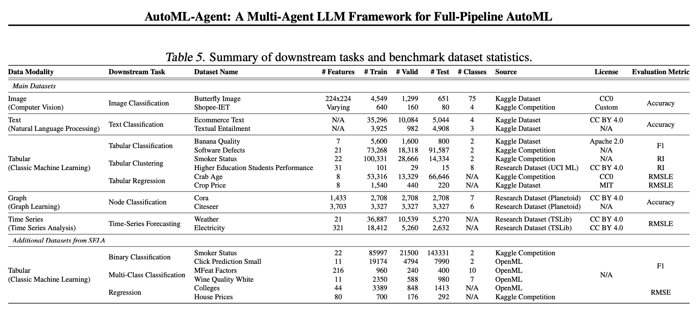

## Idea

Traditional AutoML approaches consists in finding the best values for the hyperparameters of a machine learning model. This is done usually using optimization techniques (e.g., Bayesian Optimization) or even black-box optimization techniques (e.g., Neural Networks). The main outcome here is the performance improvement.
In recent works, LLMs have been used in the AutoML field to generate not just the hyperparameters, but also the entire pipeline of the AutoML process.

This paper proposes an agentic framework able to automate the entire AutoML pipeline, including data retrieval, preprocessing, feature engineering, model selection, and training.
The agentic workflow permits also to include the human in the loop, which can refine the automl pipeline based on the feedback it receives.

## Strengths

- Human in the loop
- Non-expert users can use it

## Limitations

- Token/API costs
- Performance non comparable with traditional AutoML

## General Doubts

- should we use a single agent or multiple agents (e.g., one for feature engineering, one for model selection, one for model training)?
- should we address the dataset retrieval? in that case an ad hoc agent should be considered.
- should we focus on a single problem class or on multiple problem classes (classification, regression, clustering)?
  - in case of multiple problem classes, we should define a more complicated benchmarking setup.
    
